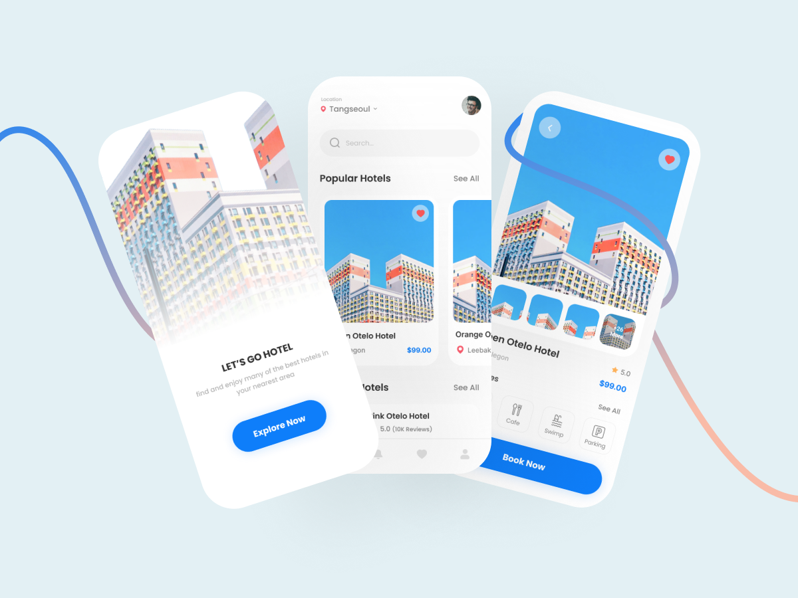
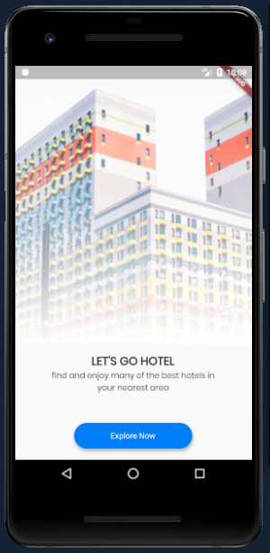
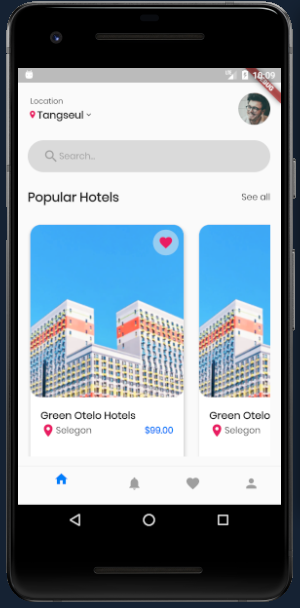
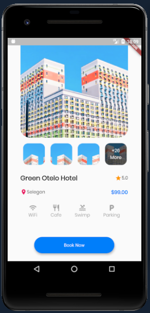

# UI KIT Booking Hotel

🔥 This is a Design to Code Booking Hotel app built with Flutter framework

## 📸 Screenshot

<pre>
          
</pre>

## Modularization Structure 🔥

    # Root Project
    .
    ├── lib                    # Name of module (default from Flutter)
        ├── common             # Common shared.
        |   ├── style          # Custom style that will be used on each widget.
        |   └── utils          # Utility classes.
        ├── ui                 # Activity/View layer
        |   ├── chat           # Chat screen
        |   ├── dashboard      # Main screen
        |   ├── home           # Home screen
        |   └── promo          # Promo screen
        └── widget             # Custom widget which can be used repeatedly.

## Finished
* [x] Modular the project based on the functionality

## Author

* **Muhamad Alamsyah**

Don't forget to follow me, fork and give me a ⭐

## License

[Muhamad Alamsyah](https://github.com/alamsyahh15)
